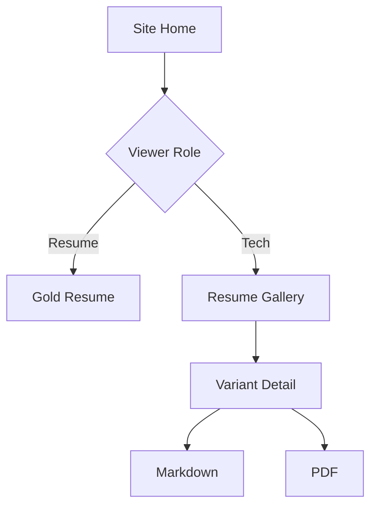

# Multi-Model Resume Lab

This repository is the source and documentation hub for a GitHub Pages project that publishes multiple resume variants generated from one canonical resume input and one shared prompt. The live site is intentionally separate from this repository README: the site landing page routes viewers to the right resume experience, while this README explains how the repository is organized.

## Project Intent

The project compares resume outputs generated with the same source data and prompt across a spectrum of model/tooling configurations:

- Frontier hosted models for the site shell and gold-standard resume.
- Hosted open-weight models for strong non-frontier comparisons.
- Local offline small language models for VRAM-constrained generation.
- A deterministic baseline for regression checks.

All variants use the same platform, source resume, prompt template, validation rules, and publishing pipeline.

## Current Demo

- `Resume` routes to the YAML-configured gold-standard resume.
- `Resume Gallery` routes to a gallery of resume pages generated by different models from the same source data and prompt (`inputs/resume.yaml` + `inputs/prompt.md`), via `scripts/generate-gallery-page.mjs`.
- Resume pages, role routing, metadata, and PDF links are driven by `config/site.yaml` and `config/resumes.yaml`.

## Local Development

```bash
npm install
npm run dev
npm test
npm run build
```

## Site Visitor Flow

The GitHub Pages site starts with a role selector, not this README.



The two role buttons must use short labels:

- `Resume Gallery`
- `Resume`

`Resume` goes directly to the configured gold-standard resume. `Resume Gallery` opens a configurable gallery of all resume variants.

## Documentation

Dense project documentation lives in `docs/`:

- [Architecture](docs/architecture.md)
- [Configuration](docs/configuration.md)
- [Prompt and Resume Inputs](docs/prompt-and-inputs.md)
- [Testing Strategy](docs/testing.md)
- [Deployment](docs/deployment.md)

## Implementation Stack

- TypeScript for orchestration and validation.
- Astro for the GitHub Pages static site.
- YAML for site routing, resume registry, model matrix, and gold-standard selection.
- Markdown as the canonical future LLM resume output.
- HTML and PDF as rendered publication formats.

## Repository Shape

```text
.
├── README.md
├── docs/
├── config/
│   ├── site.yaml
│   └── resumes.yaml
├── src/
│   ├── pages/
│   ├── components/
│   ├── layouts/
│   └── lib/
├── public/resumes/
├── tests/
└── .github/workflows/
```

## Core Guarantees

- Adding or removing a resume should be a YAML-only registry change when assets already exist.
- The site shell and gold-standard resume are generated or refined by a frontier model, with their provenance recorded.
- The `Resume` path has happy-path and sad-path tests.
- The role-selector landing page has happy-path and sad-path tests.
- Model runners are loosely coupled from rendering, routing, validation, and deployment.
