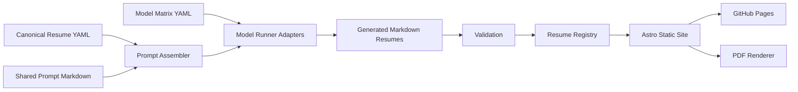
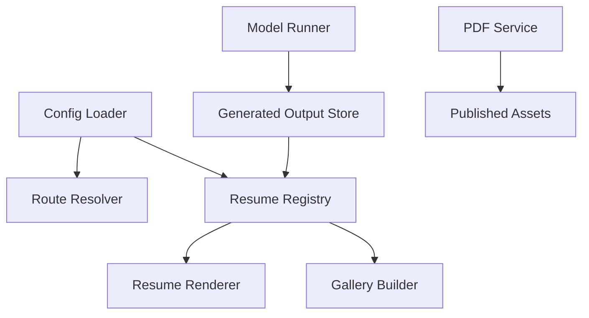

# Architecture

## System Overview

The project is a static GitHub Pages site backed by a reproducible resume-generation pipeline. It separates visitor routing, resume registry configuration, model execution, output rendering, and deployment so each part can change independently.



## Site Routing

The public site landing page is a role selector. The two selectable labels are intentionally short and stable:

- `Tech`
- `Everyone`

```mermaid
flowchart TD
    A[/] --> B[RoleSelector]
    B -->|Tech| C[/resumes]
    B -->|Everyone| D[/resume/gold]
    C --> E[/resume/:id]
    D --> F[Configured Gold Standard Resume]
```

The labels can be displayed as buttons, segmented controls, or dropdown options, but each visible option must be no more than two words.

## Gold Standard Route

The `Everyone` route resolves a configured resume identifier from `config/site.yaml`. That keeps the public default resume independent of code changes.

```yaml
roles:
  everyone:
    label: Everyone
    target: gold
  tech:
    label: Tech
    target: gallery

goldResumeId: frontier-gold
```

If `goldResumeId` does not match an enabled resume in `config/resumes.yaml`, the site should render a friendly error page at build time or fail the build during validation.

## Tech Gallery Route

The `Tech` route reads a configurable list of enabled resumes from `config/resumes.yaml`.

```yaml
resumes:
  - id: frontier-gold
    label: Gold Standard
    tier: frontier
    enabled: true
    audience: everyone
    markdownPath: generated/markdown/frontier-gold.md
    pdfPath: resumes/frontier-gold.pdf
  - id: local-8b-q4
    label: Local 8B
    tier: local
    enabled: true
    audience: tech
    markdownPath: generated/markdown/local-8b-q4.md
    pdfPath: resumes/local-8b-q4.pdf
```

The gallery should display enabled resumes only and should not require route-code changes when variants are added, disabled, or removed.

## Modular Boundaries



Recommended modules:

| Module | Responsibility | Should Not Know About |
|---|---|---|
| Config loader | Read and validate YAML | Astro route internals |
| Route resolver | Map roles to destinations | Model API details |
| Resume registry | List enabled resumes and resolve IDs | Prompt assembly |
| Model runner | Generate Markdown from prompt and input | Site navigation |
| Renderer | Convert Markdown/data to HTML | Provider secrets |
| PDF service | Print resume pages to PDF | Prompt semantics |
| Validator | Catch config, source, and output errors | Styling details |

## Frontier-Generated Hosting Code

The site shell, role selector, configurable gallery, and gold-standard route should be authored or substantially refined by a frontier model. The generated code should still be reviewed, tested, and committed like any normal source code.

Record provenance in metadata:

```yaml
hostingCode:
  generatedBy: frontier
  modelId: gpt-5.5
  reviewedBy: human
  notes: Site shell, role selector, gallery, and gold route.

goldResume:
  generatedBy: frontier
  modelId: gpt-5.5
  sourcePrompt: inputs/prompt.md
  sourceResume: inputs/resume.yaml
```
