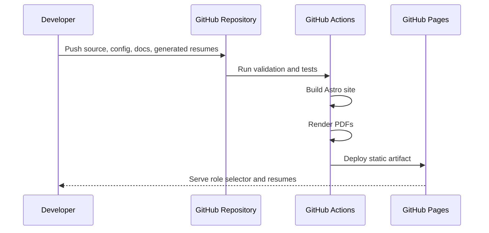

# Deployment

## GitHub Pages Target

The site should deploy as a static artifact to GitHub Pages.



## Recommended Workflows

### Validation workflow

Runs on pull request and push:

1. Install dependencies.
2. Validate YAML configs.
3. Validate canonical resume input.
4. Validate generated Markdown outputs.
5. Run happy-path and sad-path unit tests.
6. Run browser smoke tests.
7. Build the static site.

### Pages workflow

Runs on the default branch after validation:

1. Build Astro.
2. Upload static artifact.
3. Deploy to GitHub Pages.

## Secret Handling

Hosted model API keys must use GitHub Actions secrets and should not be required to deploy the static site. Generation can be a separate manual workflow so that normal docs or site edits do not require model credentials.

Suggested secrets:

```text
OPENAI_API_KEY
ANTHROPIC_API_KEY
GOOGLE_API_KEY
TOGETHER_API_KEY
```

Local offline model generation should usually happen outside GitHub-hosted runners unless a self-hosted runner is available.
