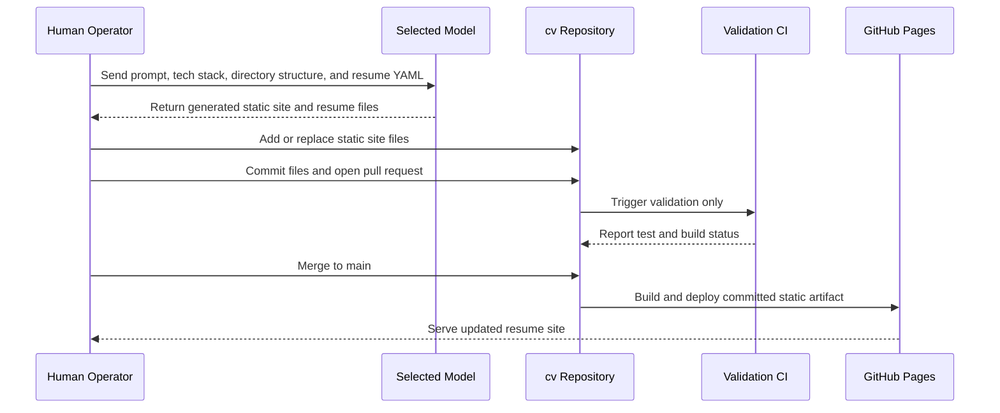

# Deployment

## GitHub Pages Target

The project deploys a static artifact to GitHub Pages. Model access and resume generation are intentionally manual and are not coupled to the GitHub Actions deployment pipeline.

The repository should contain the static site files, generated resume outputs, configuration, docs, and tests needed for validation. GitHub Actions should validate and deploy committed files; it should not call model APIs during normal pull-request validation or Pages deployment.

## GitHub Repository Settings

Before the workflow can publish the site, configure the repository on GitHub:

1. Open the `cv` repository on GitHub.
2. Go to **Settings → Pages**.
3. Under **Build and deployment**, set **Source** to **GitHub Actions**. This tells GitHub Pages to accept the artifact uploaded by `.github/workflows/deploy-pages.yml` instead of publishing from a branch.
4. Confirm GitHub Actions are enabled for the repository under **Settings → Actions → General**. If your account or organization restricts Actions, allow this repository to run workflows and allow the official `actions/*` actions used by the workflow.
5. Confirm the deployment workflow keeps the minimum Pages permissions: `contents: read`, `pages: write`, and `id-token: write`. These are already declared in `.github/workflows/deploy-pages.yml`; do not replace them with model-provider secrets.
6. Use the default `github-pages` environment unless you intentionally customize Pages environments. If protection rules are added to that environment, deployment will wait for those approvals.
7. Make sure the repository name and Astro base path agree. This repo currently builds for a project site at `/cv`; if the repository is renamed, update `base` in `astro.config.mjs`. If this becomes a user or organization site such as `<owner>.github.io`, remove the `/cv` base path.
8. Optional: configure a custom domain in **Settings → Pages → Custom domain** after the default Pages URL works.

No GitHub-side model secrets are required for normal validation or deployment because resume generation remains a manual pre-commit step.

## Manual Generation and Publication Flow



The manual flow is:

1. Send the shared prompt and YAML resume to the selected model. The prompt should include the static-site tech stack, expected directory structure, role-routing rules, output format, and validation expectations.
2. Add the generated static site files, resume files, metadata, and configuration updates to the `cv` repository.
3. Commit the files and trigger validation through a pull request.
4. Merge to `main` after validation passes; the Pages workflow deploys the committed static artifact that includes the new or updated resume.

## Prompt Requirements for Static Site Generation

The prompt used for manual generation should include enough project context for the model to produce compatible files without requiring CI-time model access.

Minimum prompt contents:

- Static-site stack: TypeScript, Astro, Tailwind CSS, YAML configuration, Markdown resume outputs, and HTML/PDF publication targets.
- Directory structure: expected `src/`, `config/`, `inputs/`, `generated/`, `public/`, `docs/`, and workflow locations.
- Site routing: `Everyone` routes to the configured gold-standard resume; `Tech` routes to the configurable resume gallery.
- Registry rules: add, remove, hide, and promote resumes through YAML configuration.
- Testing expectations: happy-path and sad-path tests for the role selector, gold route, gallery, and resume registry validation.
- Output expectations: files should be ready to commit, validate, build, and deploy without calling a model from CI.

## Validation Workflow

Runs on pull request and push. This workflow validates committed files only.

1. Install dependencies.
2. Validate YAML configs.
3. Validate canonical resume input when present.
4. Validate committed generated Markdown outputs.
5. Run happy-path and sad-path unit tests.
6. Run browser smoke tests.
7. Build the static site.
8. Optionally verify PDF assets or run PDF rendering if the renderer is deterministic and does not require model access.

The validation workflow must not require hosted model API keys.

## Pages Workflow

Runs on the default branch after validation:

1. Build Astro from committed source and generated assets.
2. Upload the static artifact.
3. Deploy to GitHub Pages.

The Pages workflow should be deterministic and should not generate new resume content. It publishes what was reviewed and merged.

## Secret Handling

Normal validation and Pages deployment should require no model-provider secrets because generation is a manual pre-commit step.

If a future optional workflow is added for assisted generation, it should be manually triggered, clearly separate from validation and deployment, and should use GitHub Actions secrets such as:

```text
OPENAI_API_KEY
ANTHROPIC_API_KEY
GOOGLE_API_KEY
TOGETHER_API_KEY
```

Local offline model generation should happen outside GitHub-hosted runners unless a self-hosted runner is available.
