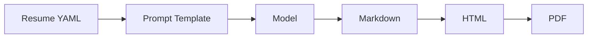

# Prompt and Resume Inputs

## Canonical Resume Input

Use a single structured YAML resume as the source of truth. YAML is recommended because it is readable, easy to diff, and simple to validate.

Recommended path:

```text
inputs/resume.yaml
```

The schema should stay close to JSON Resume while allowing project-specific metadata.

```yaml
basics:
  name: Example Person
  label: Software Engineer
  summary: Concise professional summary.
work:
  - company: Example Co
    position: Senior Engineer
    startDate: 2021-01
    endDate: present
    highlights:
      - Built a platform used by multiple teams.
skills:
  - name: Languages
    keywords:
      - TypeScript
      - Python
```

## Shared Prompt

Use one prompt template for every model configuration.

Recommended path:

```text
inputs/prompt.md
```

Recommended prompt:

```md
---
id: resume-generation
version: 1
recommended_output: markdown
---

You are an expert resume editor.

Create a truthful, concise, ATS-friendly resume using only the candidate data provided below.

Rules:
- Do not invent companies, titles, dates, degrees, credentials, metrics, or tools.
- Preserve factual accuracy over style.
- Improve clarity and impact.
- Use plain Markdown only.
- Do not include commentary outside the resume.
- Prefer concise bullets.
- If information is missing, omit it instead of guessing.

Candidate data:

{{ resume_yaml }}
```

## Recommended Output Format

The LLM should output Markdown. The site pipeline should render Markdown to HTML and PDF.



Markdown is the canonical generated artifact because it is easy to diff, easy to review, easy for models to produce, and portable across rendering systems.
